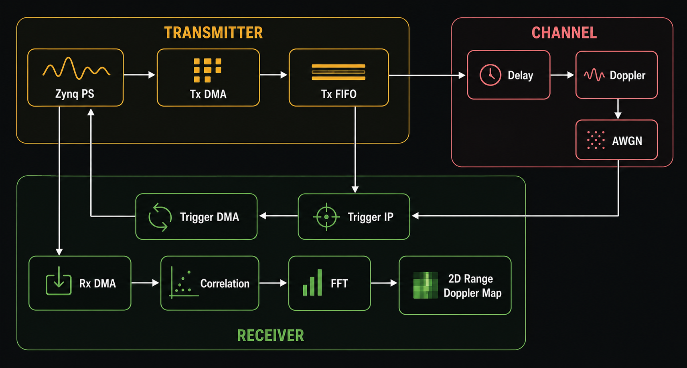

# Triggering Based Real Time Radar Signal Processing

A hardware-accelerated radar signal processing pipeline implemented on the Xilinx Zynq platform. The project performs real-time Range-Doppler processing using custom IPs designed in the Vivado Suite.

This implementation supports both:
- Golay Sequence Based Single Carrier Radar
- Zadoff-Chu (ZC) Sequence Based Multi Carrier Radar

## Features

- Trigger-based continuous radar acquisition
- Modular custom IPs
- FPGA accelerated signal processing
- DMA based PS-PL communication
- Memory mapped IPs to remove DMA overhead
- Word length optimization
- Support for Golay and Zadoff-Chu radar waveforms
- Range-Doppler map generation

## Broad Architecture



> Image Generated using https://chatgpt.com

## Source Code Structure

- This project has had multiple iterations out of which we
  documented and presented two as shown below
  1. Base
  2. Word Length Optimized
- Inside the iteration-specific directories, we have two directories for
  1. Custom IPs (dir = `IP/`)
  2. Vivado (block design) and Vitis (PS code) project (dir = `*[vV]ivado*/`)

### Golay Sequence

```
GOLAY
├── 1-base
│   ├── IP
│   │   ├── doppler_fft_256
│   │   ├── fft_1024
│   │   ├── ifft_1024
│   │   ├── project_multiplication_ip
│   │   └── trigger_ip_project
│   └── vivado_golay_full
└── 2-Word_Length_Optimization
    ├── IP
    │   ├── doppler_fft_project
    │   ├── fft_project_wlo
    │   ├── ifft_project_wlo
    │   ├── mult_project_wlo
    │   └── project_trigger_ip
    └── Vivado_golay_WLO_corr_full
```

### Zadoff Chu Sequence

```
ZC
├── 1-base
│   ├── IP
│   │   ├── doppler_fft_256
│   │   ├── fft_512
│   │   ├── ifft_512
│   │   ├── mul2_512
│   │   └── project_trigger_ip
│   └── vivado_zc_full
└── 2-Word_Length_Optimization
    ├── IP
    │   ├── doppler_fft_project
    │   ├── fft_512
    │   ├── ifft_512
    │   ├── mul2_512
    │   └── project_trigger_ip
    ├── vivado_zc_full
    └── vivado_zc_full_opt_acp
```
