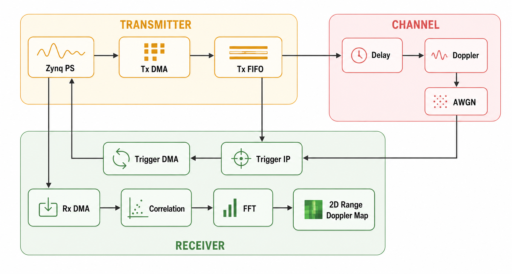

# Triggering Based Real Time Radar Signal Processing

A hardware-accelerated radar signal processing pipeline implemented on the Xilinx Zynq platform. The project performs real-time Range-Doppler processing using custom FPGA IPs while the Processing System (PS) orchestrates data movement through DMA.

This implementation supports both:
- Golay Sequence Based Single Carrier Radar
- Zadoff-Chu (ZC) Sequence Based Multi Carrier Radar

## Features

- Trigger-based continuous radar acquisition
- Modular IP-based architecture
- FPGA accelerated signal processing
- DMA based PS-PL communication
- Memory mapped IPs to remove DMA overhead
- Word length optimization
- Support for Golay and Zadoff-Chu radar waveforms
- Range-Doppler map generation

## Architecture

