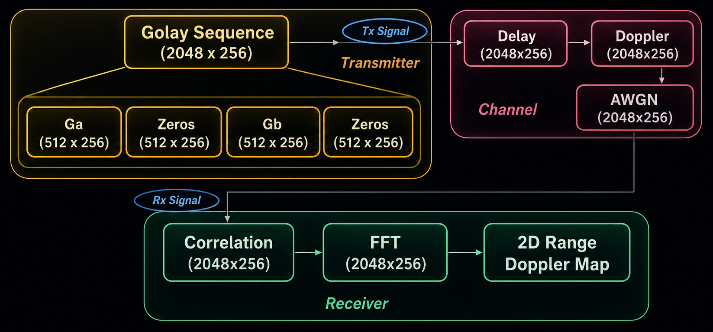
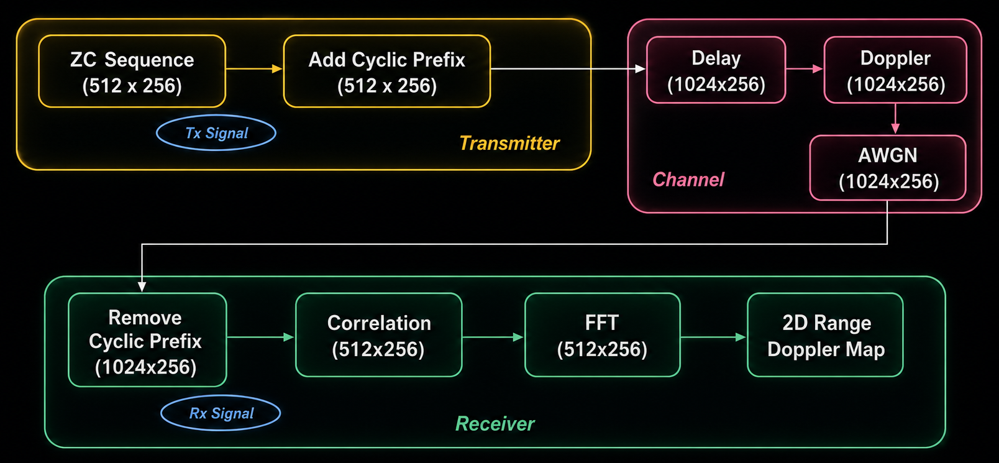

# Triggering Based Real Time Radar Signal Processing

A hardware-accelerated radar signal processing pipeline implemented on the Xilinx Zynq platform. The project performs real-time Range-Doppler processing using custom IPs designed in the Vivado Suite.

This implementation supports both:
- Golay Sequence Based Single Carrier Radar
- Zadoff-Chu (ZC) Sequence Based Multi Carrier Radar

## Features

- Trigger-based continuous radar acquisition
- Modular custom IPs
- FPGA accelerated signal processing
- DMA based PS-PL communication
- Memory mapped IPs to remove DMA overhead
- Word length optimization
- Support for Golay and Zadoff-Chu radar waveforms
- Range-Doppler map generation

## Specifications

- Center frequence = 30 GHz
- Bandwidth = 300 MHz
- Range Resolution = 0.5 m
- Maximum Range = 256 m
- Velocity Resolution = 2.86 m/s
- Maximum Velocity = +- 732.42 m/s

### Why are we sending in batches?

- We are sending 256 sequences with each containing 2048 samples (for
  golay) or 1024 samples (for ZC)
- Let us consider the case of Golay, we will have 5,24,288 samples in total.
  However, the FIFO buffer can only go up to 32,768 samples storage.
  Hence, we will be sending them in total 16 batches with each batch
  containing 32,768 samples
- Similarly, for Zadoff Chu, we will get the number of batches to be 8

## Broad Architecture


> Image Generated using https://chatgpt.com
 
### Transmitter

- The samples are picked up from the DDR (PS) with the DMA and passed to
  the FIFO buffer

### Channel

- Delay, doppler and noise is added to the samples in order to replicate
  real-life channel

### Receiver

- The `TLAST` signal from the transmitter fifo is connected to the Trigger
  IP so that it can detect when a batch has arrived
- Then, the samples are passed to the receiver DDR (PS)
- For processing the samples, they are picked up from the DDR with the DMA
  and sent for correlation to the FFT IP -> Element wise multiplication IP
  -> IFFT IP and then to another FFT IP for doppler FFT. The doppler-range
  2D map generation and peak detection happens in the doppler FFT IP itself
  instead of creating another custom IP.
 

## Source Code Structure

- This project has had multiple iterations out of which we
  documented and presented two as shown below
  1. Base
  2. Word Length Optimized
- Inside the iteration-specific directories, we have two directories for
  1. Custom IPs (dir = `IP/`)
  2. Vivado (block design) and Vitis (PS code) project (dir = `*[vV]ivado*/`)

### Golay Sequence

```
GOLAY
├── 1-base
│   ├── IP
│   │   ├── doppler_fft_256
│   │   ├── fft_1024
│   │   ├── ifft_1024
│   │   ├── project_multiplication_ip
│   │   └── trigger_ip_project
│   └── vivado_golay_full
└── 2-Word_Length_Optimization
    ├── IP
    │   ├── doppler_fft_project
    │   ├── fft_project_wlo
    │   ├── ifft_project_wlo
    │   ├── mult_project_wlo
    │   └── project_trigger_ip
    └── Vivado_golay_WLO_corr_full
```

### Zadoff Chu Sequence

```
ZC
├── 1-base
│   ├── IP
│   │   ├── doppler_fft_256
│   │   ├── fft_512
│   │   ├── ifft_512
│   │   ├── mul2_512
│   │   └── project_trigger_ip
│   └── vivado_zc_full
└── 2-Word_Length_Optimization
    ├── IP
    │   ├── doppler_fft_project
    │   ├── fft_512
    │   ├── ifft_512
    │   ├── mul2_512
    │   └── project_trigger_ip
    ├── vivado_zc_full
    └── vivado_zc_full_opt_acp
```

## Architectural Decisions

### Golay



- Golay Input Sequence is like `[ga | zero | gb | zero]` and each segment
  is of 512 samples

> From now on whenever I say `ga`, I mean the padded `[ga | zero]` and
> similarly `gb` for `[gb | zero]`

- For correlation, we have 1024 point FFT, Multiplication and IFFT IPs
- Padded ga (1024) and padded gb (1024) samples are sent to the FFT IP
- Then those are sent to the multiplication ip and then to the IFFT IP
  where they are summed in order to cancel the sidelobes and get a clean
  peak
- The correlation step has been happening row-wise i.e. we have been
  sending 2048 samples at a time (256 times) however, the doppler FFT is
  applied column-wise so we must store all the samples after correlation
  processing before they can be passed to the Doppler IP
- Due to the memory constraints of the PL, we chose to send back the
  samples to the receiver DDR and then pick them back column wise with the
  DMA and to the doppler FFT IP from where we do 2D range-doppler map
  generation and peak detection

### Zadoff Chu



- Similar to Golay but we do not have the 'ga-gb separation issue'
- Here we have 512 unique samples which are copied over once (cyclic prefix)
- At the receiver side, half of the samples are discarded from the end
  since sample shifting due to delays would have happened in a cyclic
  manner and the unique samples remain even if we discard the 2nd half
- The processing remains similar to Golay just with 512 point FFT,
  multiplication and IFFT; and no summing after the IFFT operation
